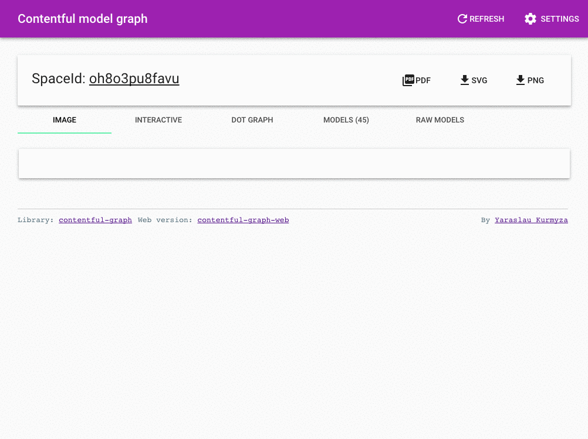

# contentful-graph-web

Simple web app utilizing [contentful-graph](https://github.com/lotas/contentful-graph) library to display graph of contentful models

# Docker

Because of the `graphviz` dependency it is better to run in container

```
docker run -it --rm -p 3000:3000 lotas/contentful-graph-web

# or

make run
```

# Demo



